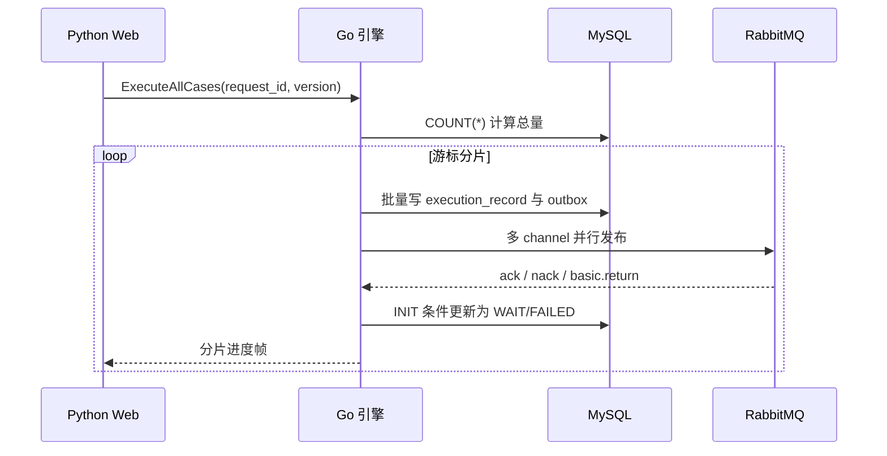

# 架构与可靠性设计

## 1. 系统边界

Python Web 是业务控制面入口，拥有用户权限、业务编排和最终执行状态。Go 引擎只负责高吞吐下发：读取用例目录、创建执行记录、投递消息以及返回下发进度。执行机仍然消费 RabbitMQ，并回调 Python Web 更新最终状态。

这个边界有两个好处：一是性能热点可以独立扩缩容；二是不迁移原有 Web 业务和状态回调，降低改造风险。代价是系统增加一次 gRPC 跳转和一套独立部署，需要明确超时、幂等和可观测性语义。

## 2. 批量流水线

生产者通过主键有序游标扫描，避免一次性加载全部用例。固定数量的工作协程处理分片，聚合器串行发送流式进度，避免多个协程并发调用 `stream.Send`。全局信号量限制同时运行的批量 RPC，防止多个大请求叠加压垮数据库与 MQ。

## 3. DB 与 MQ 一致性

直接采用“先提交 DB，再发布 MQ”存在崩溃窗口；采用“先发 MQ，再提交 DB”则可能出现没有执行记录的孤儿任务。RabbitMQ 不参与 MySQL 本地事务，因此这里采用事务 Outbox：

1. 在同一 MySQL 事务中写入 `execution_record` 和 `dispatch_outbox`。
2. 正常路径立即发布，降低端到端延迟。
3. 发布成功后把执行记录改为 WAIT、Outbox 改为 PUBLISHED；失败则改为 FAILED/DEAD。
4. 进程崩溃留下的 PENDING 消息由 Relay 轮询恢复。

投递语义是至少一次，不是恰好一次。MQ 已确认但数据库状态尚未提交时崩溃，Relay 无法判断消息是否已经到达，必须重新发布。消息以 `execution_id` 作为 `message_id`，执行机需要据此幂等消费。

## 4. 多实例 Outbox Relay

Relay 使用 `SELECT ... FOR UPDATE SKIP LOCKED` 领取可用记录，并在同一事务中写入 PROCESSING、租约时间、随机租约令牌和尝试次数。更新 PUBLISHED、PENDING 或 DEAD 时必须同时匹配租约令牌。

只有租约时间无法解决“旧实例暂停后恢复”的问题：A 的租约过期后 B 重新领取，A 随后完成并回写，会覆盖 B 的新状态。随机租约令牌把每次领取变成独立世代，旧世代更新会因影响行数不匹配而失败。

## 5. RabbitMQ 发布语义

每个并行工作协程独占一个 `amqp.Channel`，多个 channel 复用同一 TCP 连接。客户端维护固定大小的 channel 池，并为每个 channel 开启 Publisher Confirm。

- ack：交换机接受了消息，但不代表存在可消费路由。
- nack：Broker 未接受消息，归入失败集合。
- `basic.return`：启用 `mandatory` 后，无路由消息会返回，归入失败集合。
- 超时或 channel 关闭：所有未决序号归入失败集合，损坏 channel 不再放回池。
- 连接断开：借用方阻塞等待指数退避重连或自身上下文取消。

## 6. 幂等与状态竞争

调用方重试时复用 `request_id`。数据库唯一键 `(request_id, case_id)` 处理并发重试，插入冲突后回读已有执行记录。已有记录不是 INIT 时直接返回既有下发结果，不重复投递。

下发回写使用 `WHERE execution_status = 'INIT'`。如果执行机处理很快，已经通过 Python Web 把状态推进到 RUNNING 或 SUCCESS，迟到的 WAIT 回写不会造成状态回退。更新没有命中时会再次查询：记录存在表示状态已被合法推进，记录不存在才是错误。

## 7. 取消与优雅停机

扫描、工作协程、RabbitMQ 借用与确认等待都响应请求上下文。MQ 发布完成后，状态回写使用 `context.WithoutCancel` 派生的 5 秒补偿上下文，避免客户端断开导致记录永久停在 INIT。

进程退出顺序如下：

1. 健康检查切换为 NOT_SERVING，停止接收新 RPC 并等待在途请求。
2. 停止 Outbox Relay。
3. 关闭 RabbitMQ channel 池和连接。
4. 最后关闭 MySQL 连接池。

## 8. 明确限制

- 消费端必须实现 `execution_id` 去重，否则至少一次投递可能造成重复执行。
- gRPC 当前使用内网明文连接；跨信任域部署时需要 mTLS 与调用方身份校验。
- 当前以结构化日志和健康检查为主要观测手段；正式大规模部署应接入 Prometheus，关注下发吞吐、确认延迟、失败率、Outbox 积压与租约回收量。
- 批量请求的 `request_id` 语义是“同一次请求中的同一用例幂等”；调用方不得把同一标识复用于不同业务操作。
